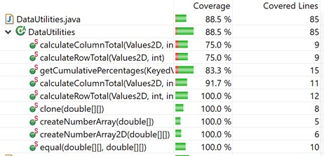

**SENG 438 - Software Testing, Reliability, and Quality**

**Lab. Report #3 – Code Coverage, Adequacy Criteria and Test Case Correlation**

| Group \#: 3    |     |
| -------------- | --- |
| Student Names: |     |
| Tsenguun       |     |
| Saman          |     |
| Aryan          |     |

(Note that some labs require individual reports while others require one report
for each group. Please see each lab document for details.)

# 1 Introduction

The purpose of this assignment is to become familiar with using code coverage tools (EclEmma) to measure test adequacy, and use white-box coverage criteria to create test cases. 

# 2 Manual data-flow coverage calculations for X and Y methods

DataUtilities.calculateColumnTotal:

Range.contains:

# 3 A detailed description of the testing strategy for the new unit test

We will design unit tests for 2 classes, org.jfree.data.DataUtilities and org.jfree.data.Range, to meet the criteria of 90% statement coverage, 70% branch coverage, and 60% method coverage. We plan to split the methods we need to test evenly between team members. Our plan is to improve the coverage of the test suite we created in the previous assignment, then expand the test suite to include test cases for the new methods introduced for this assignment. To design test cases, we will look at the source code of the method that we are testing and create test cases that will go through as many lines of the code as possible. Then we will see the coverage metrics and develop further test cases as needed. The methods to be tested from each class are listed below along with notes on whether the test designs were improved on from the previous assignment or newly created for this assignment: 

DataUtilities:
(From assignment 2)
-calculateColumnTotal(Values2D data, int column)-> could not increase statement and branch coverage because of unreachable code
-calculateRowTotal(Values2D data, int row)-> could not increase statement and branch coverage because of unreachable code
-createNumberArray(double[] data) -> improved on to reach 100%
-createNumberArray2D(double[][] data) -> improved on to reach 100%
-getCumulativePercentages(KeyedValues data) -> could not increase statement and branch coverage because of unreachable code

(Additional)
-calculateColumnTotal(Values2D data, int column, int[] validRows) -> newly created
-calculateRowTotal(Values2D data, int row, int[] validCols) -> newly created
-clone(double[][] source) -> newly created
-equal(double[][] a, double[][] b) -> newly created

Range:
(From assignment 2)
-constrain(double value) -> improved on to reach 100%
-contains(double value) -> improved on to reach 100%
-getLength()-> could not increase statement and branch coverage because of unreachable code
-getLowerBound() -> could not increase statement and branch coverage because of unreachable code
-getUpperBound() -> could not increase statement and branch coverage because of unreachable code

(Additional)
-combine(Range range1, Range range2) -> newly created
-combineIgnoringNaN(Range range1, Range range2) -> newly created
-equals(Object obj) -> newly created
-expand(Range range, double lowerMargin, double upperMargin) -> newly created
-expandToInclude(Range range, double value) -> newly created
-getCentralValue() -> newly created
-hashCode() -> newly created
-intersects(double b0, double b1) -> newly created
-intersects(Range range) -> newly created
-isNaNRange() -> newly created
-scale(Range base, double factor) -> newly created
-shift(Range base, double delta) -> newly created
-shift(Range base, double delta, boolean allowZeroCrossing) -> newly created
-toString() -> newly created

# 4 A high level description of five selected test cases you have designed using coverage information, and how they have increased code coverage

The following test cases are from CombineIgnoringNaNTest.java which is a test suite for testing the Range.combineIgnoringNaNTest function. 

testCombineNullRange1NaNRange2: tests the function with arguments range1 = null, range2 = (Double.NaN, Double.NaN). This covers the first if statement in the function, if(range1==null), as well as the if statement within it, if(range2 != null && range2.isNaNRange()). This increases the line coverage by 3, branch coverage by 2, and method coverage by 1.

testCombineNullRange1: tests the function with arguments range1 = null, range2 = (4, 7). This covers the first if statement again, if(range1==null), as well as the if statement within it, if(range2 != null && range2.isNaNRange()). This increases the line coverage by 1, branch coverage by 1, and method coverage by 0.

testCombineNullRange2NaNRange1: tests the function with arguments range1 = (Double.NaN, Double.NaN), range2 = null. This covers the second if statement, if(range2==null), as well as the if statement within it, if(range1.isNaNRange()). This increases the line coverage by 3, branch coverage by 2, and method coverage by 0.

testCombineNullRange2: tests the function with arguments range1 = (4,7), range2 = null. This covers the second if statement, if(range2==null), as well as the if statement within it, if(range1.isNaNRange()). This increases the line coverage by 1, branch coverage by 1, and method coverage by 0.

testCombineValidRanges: tests the function with arguments range1 = (4,7), range2 = (5,8). This covers the code after the two if statements. This increases the line coverage by 4, branch coverage by 1, and method coverage by 3.

# 5 A detailed report of the coverage achieved of each class and method (a screen shot from the code cover results in green and red color would suffice)

We didn’t reach the statement coverage goal of 90% for DataUtilities because of unreachable code in functions calculateColumnTotal, calculateRowTotal, and getCumulative Percentages.

Statement Coverage of DataUtilities:

Branch Coverage of DataUtilities:

Method Coverage of DataUtilities:

Statement Coverage of Range:

Branch Coverage of Range:

Method Coverage of Range:

# 6 Pros and Cons of coverage tools used and Metrics you report

The coverage tool we used was EclEmma, the advantage of this tool is that it comes pre-installed on eclipse and is integrated into the environment which makes testing for coverage very easy. However this tool did not have an option to view condition coverage, so we decided to cover method coverage instead. The metrics we reported are line coverage, branch coverage, and method coverage. Line and branch coverage are beneficial because it allows us to get a clear idea of how much of the coded functionality is being covered. We can immediately see whether or not every line of the source code is covered as well as if every branch statement is covered. Method coverage is also useful to see whether or not we are actually using the methods we are supposed to be testing.

# 7 A comparison on the advantages and disadvantages of requirements-based test generation and coverage-based test generation.

Requirements-based test generation is very important for ensuring that the code actually follows the specifications and has the same behavior that is expected in the documentation. Coverage based test generation helps us ensure that the tests we are writing actually cover all of the source code we are testing. Requirements based generation can reveal issues that would not be caught by coverage based generation, more specifically just because all of the code is being covered that does not mean that the code adheres to the required functionality. Conversely if we only use Requirements based generation, we may not cover all of the source code as there may be additional functionality added that we did not know about. The best practice is to use both generation methods in order to cover both the required functionality and all of the functionality that has been implemented.

# 8 A discussion on how the team work/effort was divided and managed

One of the team members worked on the data flow graphs and the coverage calculations, one of the team members worked on the tests for the DataUtilities class, one of the team members worked on the tests for the Range class.

# 9 Any difficulties encountered, challenges overcome, and lessons learned from performing the lab

There were some difficulties with transferring the test suite from the last assignment into the new project, there was a missing reference file that we needed to download separately. 

# 10 Comments/feedback on the lab itself

Nothing to comment.
