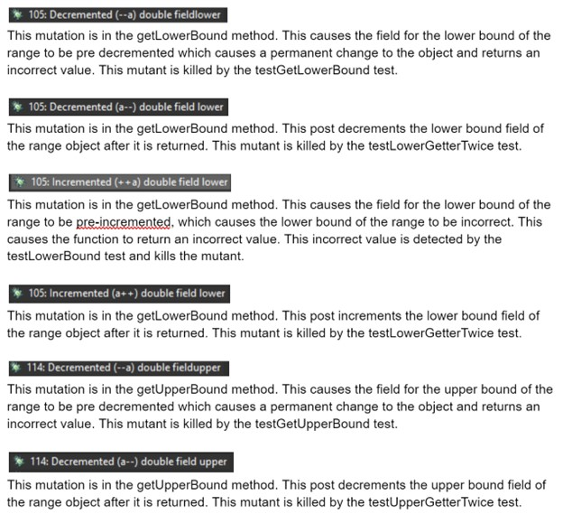
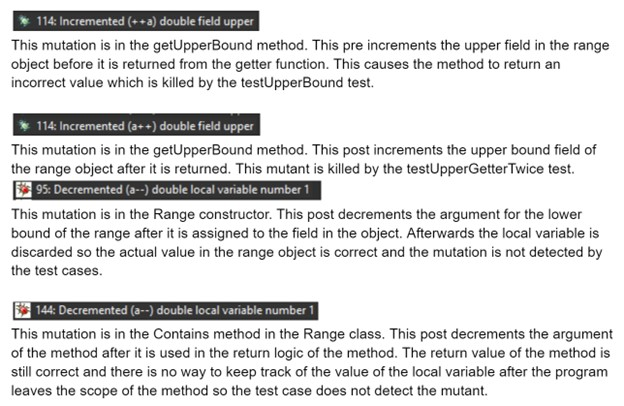
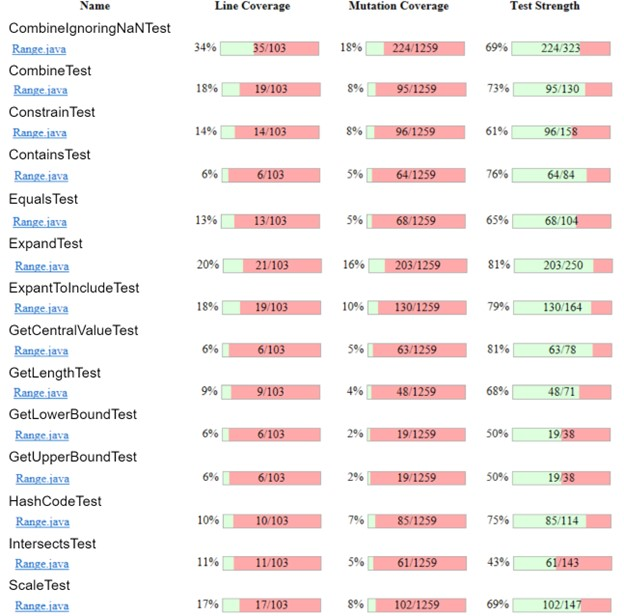
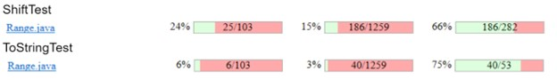
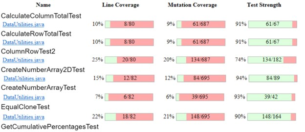
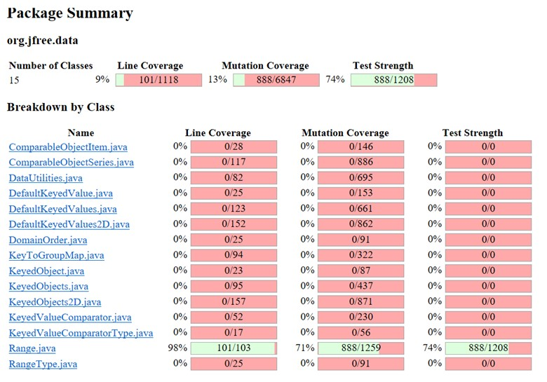
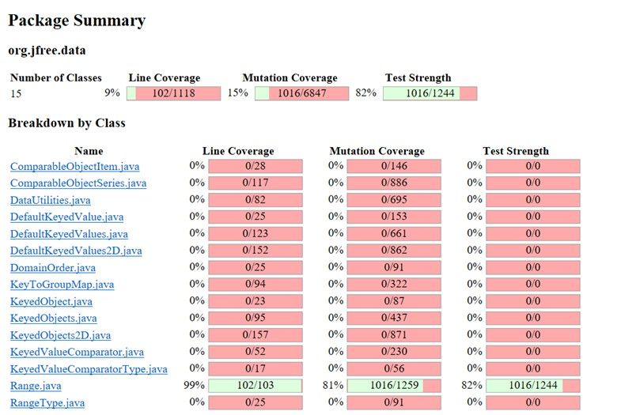
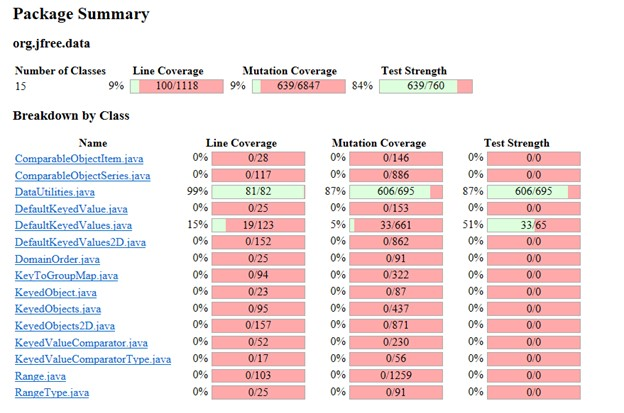
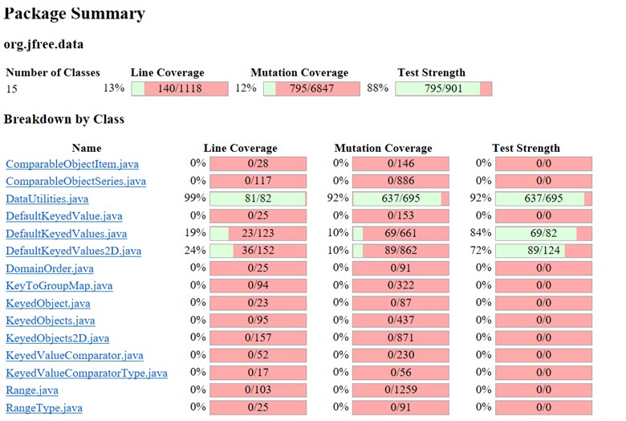
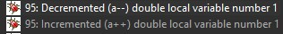

**SENG 438 - Software Testing, Reliability, and Quality**

**Lab. Report \#4 – Mutation Testing and Web app testing**

| Group \#:      |  3   |
| -------------- | --- |
| Student Names: |     |
|     Tsenguun           |     |
|         Saman       |     |
|        Aryan        |     |

# Introduction
Through this lab we became familiar with mutation testing and GUI testing.

# Analysis of 10 Mutants of the Range class 
  
  

# Report all the statistics and the mutation score for each test class
Range tests:  
  
  

DataUtilities tests:  
  

Mutation score for Range classes before adding more tests (71%):  
  

Mutation score for Range classes after adding more tests (81%):  
  

Mutation score for DataUtilities classes before adding more tests (87%):  
  

Mutation score for DataUtilities classes after adding more tests (92%):  
  

# A discussion on the effect of equivalent mutants on mutation score accuracy
Equivalent mutants can make the mutation score more inaccurate. Specifically the equivalent mutants inflate the number of surviving mutants because they will not be killed by the test suite, this is because their functionality is identical to correct behavior. An example of some equivalent mutants found is below:  
  
These two mutants are in the constructor of the Range class. They were found by analyzing the surviving mutations. They decrement and increment a local variable in the constructor after it has been used. The local variable is then discarded and never used again. Therefore these mutants have no actual consequence on the correct behavior of the class and are equivalent to the previous code. However these mutants contribute to the number of surviving mutants, this causes the mutation score to report lower than it really is.

# A discussion of what could have been done to improve the mutation score of the test suites
We improved the mutation score of the test suite by manually analyzing the surviving mutants of the PIT report. We would go over the surviving mutants and trace where they occur in the source code and the impact that they have. We would then design test cases that would explicitly look for the changes that these mutants cause and would fail on those cases. The mutation score for dataUtilities was already at 87 percent which made it difficult to achieve the 10 percent increment in mutation score, but we were able to increment it by five percent to a 92 percent mutation score.

# Why do we need mutation testing? Advantages and disadvantages of mutation testing
Mutation testing helps us make our unit test suits more robust. During this lab we discovered that there can be many hidden errors in the source code that are not picked up by conventional tests. Mutation reveals these holes in our test suite and allows us to account for and cover a wider variety of scenarios that could occur. For example in our previous test suite, we never accounted for the fact that a method could potentially have a correct return value, but could also change the object in unintended ways behind the scenes, leading to incorrect behavior further down the line. In this way mutation testing can be very beneficial, however not all mutations are meaningful. A large number of mutants cause the program to not compile, or are equivalent to previous functionality. This clouds the results of a mutation test with many junk mutants that do not contribute to more robust testing. Therefore we must filter through these equivalent mutants which can cause mutation testing to be less accurate and more ambiguous.

# Explain your SELENUIM test case design process
To design the test cases, we decided on 6 (because we have 3 members) functionalities of the website (amazon.ca) to test. Then, we came up with different test data we can use to test each functionality. We made sure that our functionalities were sequences of events that didn’t require being signed in to amazon, so that our real account information wouldn’t need to be used.

# Explain the use of assertions and checkpoints
For each script, we used text assertions to make sure the page displays the expected text and information when we click a button. Below are the assertions used for each test case.  

LoginInvalidEmail: assert text “We cannot find an account with that e-mail address” after user enters an invalid email.  
LoginWrongPassword: assert text “Your password is incorrect” after entering the wrong password.  
SearchInvalid: assert text “No results for” after entering invalid search.  
SearchJenga: assert text “RESULTS” after entering jenga in the search.  
SearchMultiple: assert text “cat dog toy” after entering “cat dog toy” in search.  
AddToCartOneItem: assert text “Added to Cart” after adding one jenga item to cart.  
AddToCartFiveItems: assert text “Added to Cart” after adding five jenga items to cart.  
ChangeLanguageEnglish: assert text “All” after changing language to English.  
ChangeLanguageFrench: assert text “Toutes” after changing language to French.  
SetLocationInvalid: assert text “Please enter a valid Canada postal code” after entering an invalid postal code in location.  
SetLocationValid: assert text “Deliver to” after setting location to valid postal code.  
SignInPromptPurchase: assert text “Sign in” after pressing the button to purchase an item when signed out.  
SignInPromptReturnsOrders: assert text “Sign in” after pressing the button to view Returns & Orders.  

# how did you test each functionaity with different test data
We tested each functionality with different valid and invalid inputs as listed below.  

Login: We tested the login functionality with an invalid email, then with a valid email with a wrong password.  
Search: We tested the search functionality using an invalid search word, a valid search word like ‘jenga’, and with multiple valid search words separated by spaces.  
Add to Cart: We tested adding to cart functionality by adding 1 item, and 5 items.  
Change Language: We tested change language functionality by changing language to French, and English.  
Set Location: We tested the set location functionality by typing an invalid postal code, then a valid postal code.  
Get Prompted to Sign In: We tested the functionality of getting prompted to sign in when attempting to do something that requires you to be signed in. We tested this by trying to purchase an item, and by trying to view our Returns & Orders.  

# Discuss advantages and disadvantages of Selenium vs. Sikulix
The disadvantages of SikuliX is that it can’t be used to automate web browsers directly and must be used with another tool like Selenium. SikuliX requires visual elements like images and videos to automate tasks. This can be an advantage for automating tasks based on visual elements that can’t be done with traditional tools, but can be a disadvantage because it can be limiting if there aren’t many images or videos.  

The advantage of Selenium is that it is easy to do GUI testing on web-based applications. It has convenient scripting capabilities so you can automate complex tasks for testing. The disadvantage is that its visual automation is limited compared to SikuliX. Another disadvantage is that it requires web elements like HTML tags and attributes to automate tasks which can make things difficult if web elements keep changing or are unavailable.  

# How the team work/effort was divided and managed
We worked on mutation testing as a team and each team member tested 2 functionalities for GUI testing.  

# Difficulties encountered, challenges overcome, and lessons learned
It was difficult to understand mutation testing at first.  

# Comments/feedback on the lab itself
Nothing to comment.  

