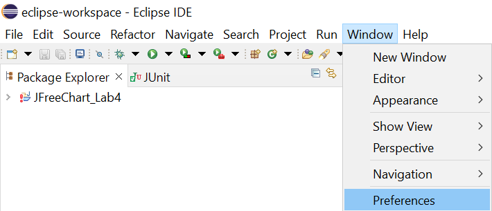
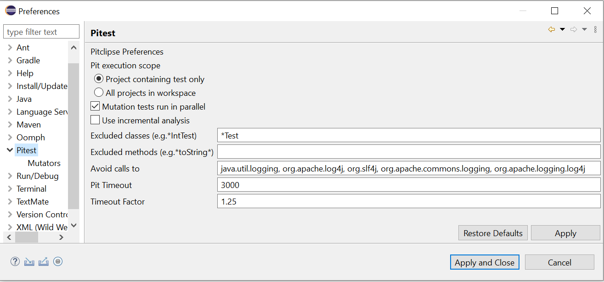
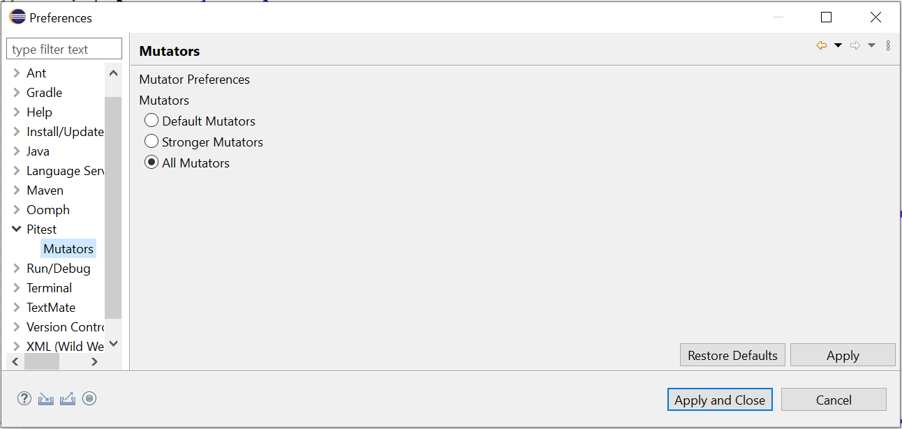
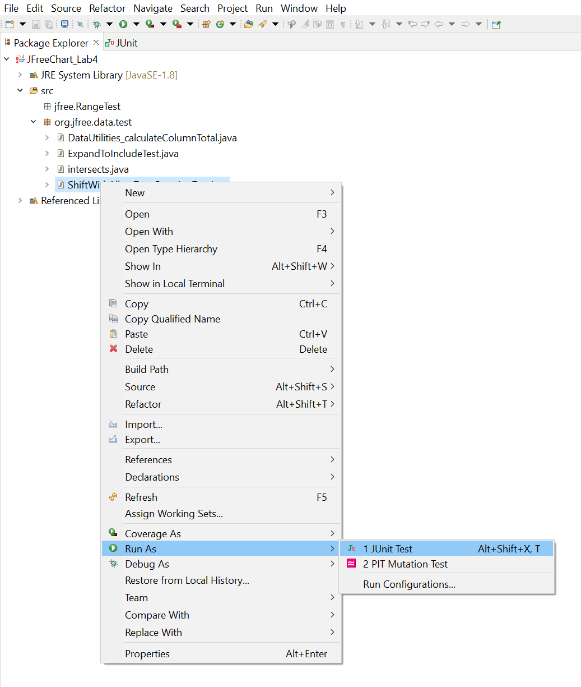
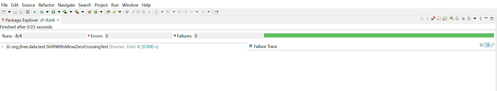
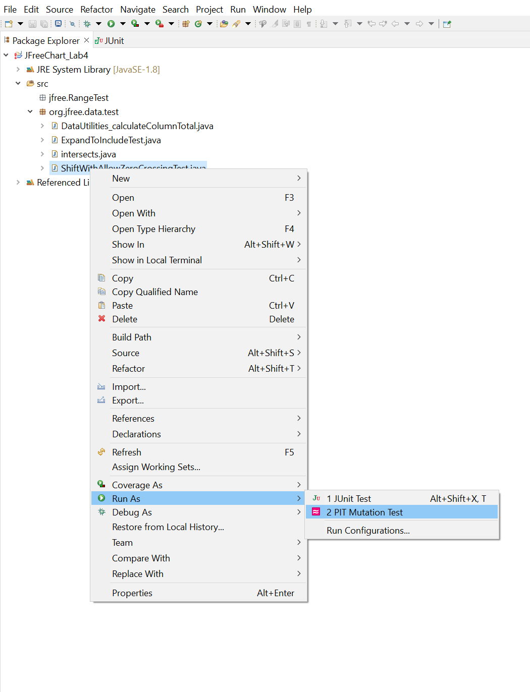
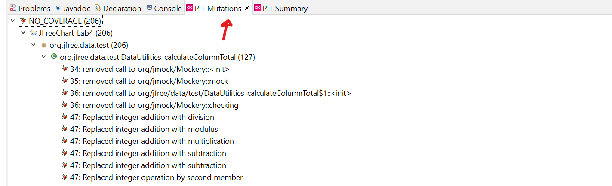
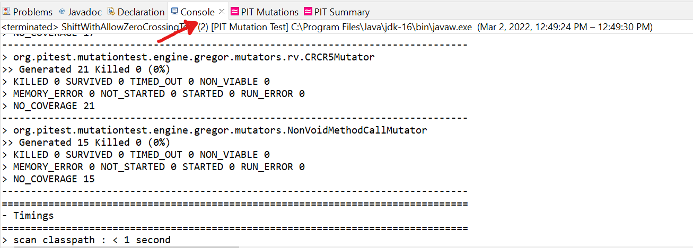

**SENG 438 - Software Testing, Reliability, and Quality**
> **Assignment \#4**
>   ****Mutation Testing (Fault Injection) & GUI and Web Testing****
>   Instructors: 
>   -   Dr. Behrouz Far (far@ucalgary.ca)
>   -   Dr. Kangsoo Kim (kangsoo.kim@ucalgary.ca)
> 
>   Department of Electrical and Software Engineering
>   University of Calgary

Due Date: Check D2L for the submission deadline.

> **Summary:
> Part 1:**

- Install a mutation test tool.

- Run mutation testing for the given test codes and your own test codes and
  record the results.

- Identify some equivalent mutants and describe your approach for finding them

- Design new test cases to increase your mutation score by at least 10% for
  each class (Classes under test: `Range.java`, `DataUtilities.java`)

> **Part 2:**

- Install Selenium (TESTING TOOLS).

- Follow instructions in Section 2: (INSTRUCTIONS)

  - Design test cases for at least 2 functionalities (per student) of the
    selected websites.

  - Automate your designed test cases using Selenium and add verification
    points to your scripts

- Compare Selenium with Sikulix

# 1 INTRODUCTION

This lab includes two parts: Mutation Testing and GUI Testing.
Through part one, the students will learn how to inject mutation faults in a Java code-base using a mutation testing tool and how to interpret the reported mutation scores and use that knowledge to design new test cases to improve the overall quality of the test suite.
Part two, focuses on most common way of GUI test automation, record and replay. Students will learn how to use a very well-known tool for web interface testing (Selenium) and will compare it with another alternative.

# 2 PART 1: MUTATION TESTING

## 2.1 OBJECTIVES

The purpose of the first part of this assignment is to give students hands-on experience in assessing the effectiveness of their test suites created in assignments 2 and 3 using mutation testing. To do this, students will need to create mutants (faulty versions) of the SUT, and then run their test suite against the mutants to determine if their test suite can accurately distinguish (kill!) mutants.

After completing part 1, students will:

- gain an understanding of what mutation testing is and why it is useful

- be able to measure the mutation score of their test suites in order to analyze the results

- become familiar with the use of a mutation testing tool

## 2.2 TESTING TOOLS

The only testing tool to be used in this part, aside from JUnit is Pitest [4], a mutation tool which includes a plug-in for Eclipse. Pitest is aimed at providing testers with a tool which provides automated generation of mutants, as well as running tests against those mutants.

Pitest streamlines the process of creating mutants by providing a mutant generation engine based on many defined mutation operators. Pitest provides functionality to facilitate the creation of mutants as well as running unit tests on those mutants in order to calculate a mutation score.

As discussed in the class, mutation operators in Java object-oriented software are generally of two types: method-level [1] and class-level [2]. Some of the tools (e.g. Pitest) by default employs only mutation operators at the method-level. You need to enable the class-level mutators before starting your tests.

## 2.3 SYSTEM UNDER TEST

Similar to assignments 2 and 3, the system to be tested for this part is JFreeChart [3]. To get started with the JFreeChart system, download the “JFreeChart v3.0.zip” file from assignment 4 folder and extract the entire archive to a known location.

## 2.4 FAMILIARIZATION

### 2.4.1 INSTALL Pitest

1.  In your Eclipse select Help, go to Eclips Marketpalce, and find Pitest Plugin by copy and paste the following link: https://marketplace.eclipse.org/content/pitclipse

2.  Follow the installation process. Note: Run Eclipse “as administrator” in Windows, click on preferences, on the left side click on Pitest and then select Mutators, choose All mutators, and finally apply and close. If you can not find preferences trough window tab you can simply look for it in the search (up right corner). The latest **version is Pitclips 2.2.0**

3.  If you could not find the Pitclipse in your Eclipse Marketplace please do the followings:

    1.  Start Eclipse, then select Help \> Install New Software.

    2.  Click Add, in the top-right corner.

    3.  Put Name: Pitclipse and Location: <http://eclipse.pitest.org/release/>

    4.  Press Add and follow the installation process

Note that, Pitest by default employs only mutation operators at the method-level. **You need to enable the class-level mutators before starting your tests.** Follow these steps to select all mutators.

**Figure 1 – Enabling mutators in Pitest**

## 2.5 INSTRUCTIONS

## 2.5.1 Mutation Testing

You should run Pitest on your own test suites `DataUtilitiesTest` and `RangeTest` from assignment 3.

### 2.5.2 Create a new Eclipse project

Add the JFreeChart source code given in assignment 4 to your project. Add all libraries into your project. Add the given sample test codes (provided in this assignment) into your project.

## 2.5.3 Add your own Test Suites from lab 3 into your new project.

### 2.5.4 Run Mutation Testing on the sample test cases

As a practice, run mutation tests on the test cases provided under `org.jfree.data.junit` in the test folder of _JFreeChart_Lab4_ project. Record all results. (Right click on the `org.jfree.data.junit` and then run as PIT Mutation Test)

1.  Note that in order to run mutation tools successfully, your test cases must pass (all green). For example, the `DataUtilitiesTes` test case has error in `org.jfree.data.junit`, running Pitest you will get exception. If there is any defect that is found by the tests (error/failure), they need to be fixed in the code before running the mutation tool.

2.  Expect that mutation testing of some classes might take long time. Let the tool runs and do not terminate it until the test ends and you get the mutation testing reports.

> 

> 

> 

### 2.5.5 Run Mutation Testing on your own test cases

- Run mutation tests on your `Range` test classes from assignment 3. Record all results.

- Run mutation tests on your `DataUtilities` test classes from lab 3. Record all results.

  - You might require to fix your test codes, if you find out that your test cases are not correct.

  - You might require to fix the source code, if your test code detects any defect.

- Analysis of at least 10 mutants produced by Pitest for the `Range` class, and how they are killed or not by your original test suite

### 2.5.6 Equivalent Mutants

Try to come up with a way that you could automatically detect a few equivalent mutants in your experimentation, for classes `Range` and `DataUtilities`. If you think you have found a way, discuss it in your report, along with its benefits, disadvantages, and assumptions. Try to detect a few equivalent mutants manually in classes `Range` and `DataUtilities` (to do this, you will need to investigate the mutation logs generated by the tool).
Report the process you followed for this part plus your findings and results in your lab report. Note that the number of equivalent mutants found is not as important as the understanding of how to detect them and the discussion of how you found them.

### 2.5.7 Add More Test Cases to increase Mutation Score

In this phase, we want to increase the mutation score. For each of the classes under mutation testing (`Range` and `DataUtilities`), measure the mutation score of your original test suites from assignment 3. Aim at increasing mutation scores for `Range` and `DataUtilities` each by at least 10%, e.g., if it is 55%, make it at least 65%. Discuss in your report the test cases that you had to add to increase the mutation score, and also how you designed them.

# 3 Part 2: GUI TESTING

## 3.1 OBJECTIVES

The main objective of this part of the assignment is to familiarize students with automated GUI testing and to become comfortable with some of the features that many record and replay testing tools have. Also, students will understand the differences between automated and manual GUI testing.

## 3.2 TESTING TOOLS

In this assignment, you will mainly use Selenium web-interface testing tool to test one of the following websites.

- Costco page

- Amazon Page

- IKEA Page

You will also explore this alternative tool: Sikulix (http://sikulix.com/quickstart/)

## 3.3 INSTRUCTIONS

1.  Make yourself familiarize with Selenium IDE plug-in and how to run record and replay (playback) with Selenium. You may use these recourses and/or others online.

    1.  <http://www.seleniumhq.org/projects/ide/>

    1.  <http://toolsqa.com/selenium-ide-tutorial/>

    1.  <https://www.guru99.com/install-selenuim-ide.html>

1.  **Design** your UI test cases:

    1.  UI test cases are sequence of events on the GUI/web interface.

    2.  Each student must automate at least 2 **different functionalities of the application** under test. For example, Login, Purchase for an online shopping system, etc. (i.e., minimum 8 tests for teams with 4 students).

2.  **Automate** your test cases, using Selenium:

    1. Each functionality must be tested with different possible test data. For example, Login with valid, invalid user.

3.  **Verify** the output of the tests by adding verification check points.Verifications must be done automatically unless the tool does not support automated verification in that specific context, which in that case report that as disadvantages of the tool and design another test that can be automated.

4.  **Execute** your recorded scripts to test the system.

5.  **Document** defects at the end of your report file, if you find any during test automation (Note: Given applications are almost stable, do not expect to find many defects in these applications. It is acceptable that students report no defects in this assignment).

6.  **Compare** Selenium IDE with an alternative tool (Sikulix). You do not have to run your tests with this tool. Only report your experience with the tool and pros and cons of it compared to Selenium.

7.  **Submission:**

    1.  Based on the experience that you had with Selenium and Sikulix, answer the questions in the template report file and submit it on GitHub.

    2.  Submit your Selenium test scripts and provide all required files for running your scripts. Your test scripts should not be computer dependent and must be run on your TAs computer.

        1.  Your TA will ask you to demo your scripts in lab.

# 4 Evaluation Criteria

## 4.1 Demo (15%)

The objectives for the demo are a) Preparing you for technical presentations, b) an early assessment of your work to give you a second chance to submit a high-quality report, and c) making sure everybody in the team contributes evenly.

It is mandatory for all team members to attend the demo session and explain the TAs in the lab what they have done for this assignment. For this particular assignment, Lab8 is the demo day. You are expected to almost finish the assignment by the lab hour. All the team members should attend the lab. The TAs will go through the groups and each group must demonstrate one mutant (generated by PIT) that is killed by the original test suite and one that is not. Different student should demonstrate different mutants.
Each student should also run a recorded test case with Selenium IDE.

**NOTE1: Student who miss the demo session or are unable to demo what is detailed above are considered as less- contributors and may lose up to the entire assignment 3’s mark.**

**NOTE2: You still have time to further improve your test suite, after the demo session and before the deadline.**

## 4.2 Lab report and Test suites (85%)

Students will be required to submit a report on their work in the lab as a group. To be consistent, please use the template markdown file “Assignment4-ReportTemplate.md” provided online under the Assignment 4 folder. If desired, feel free to rename the sections, as long as the headings are still descriptive and accurate.

**NOTE3: include folder together with your report. One containing Part 1’s final test suite, another containing Selenium test scripts.**

A portion of the grade for the lab report will be allocated to organization and clarity. The report marking scheme is as follows:

| **Mutation Testing (50)**                                                                                                                                         |     |
| ----------------------------------------------------------------------------------------------------------------------------------------------------------------- | --- |
| Analysis of at least 10 mutants produced by Pitest for the `Range` class, and how they are killed or not by your original test suite                              | 10  |
| All the statistics and the mutation score for each of the mutated classes (`Range` and `DataUtilities`) with each test suite class (original and the updated one) | 20  |
| A discussion on the effect of equivalent mutants on mutation score accuracy including a discussion on how equivalent mutants could be detected                    | 10  |
| A discussion of how you improved the mutation score of the test suites. Your design strategy.                                                                     | 5   |
| A discussion on the advantages and disadvantages of mutation testing                                                                                              | 5   |
| **GUI Testing (33)**                                                                                                                                              |     |
| Correctness and completeness of the Recorded test cases (at least 2 per group member)                                                                             | 10  |
| Explain your test case design process                                                                                                                             | 5   |
| Use of automated verification points in each script. If automated verification point is not used, provide valid reason                                            | 5   |
| Use different test data per test. If not used, provide valid reason                                                                                               | 5   |
| Discuss advantages and disadvantages of Selenium vs. Sikulix                                                                                                      | 8   |
| **Other (2)**                                                                                                                                                     |     |
| A discussion on how the team work/effort was divided and managed. Any lessons learned from your teamwork on this lab?                                             | 2   |

# 5 REFERENCES

[1] J. O. Yu-Seung Ma, "Description of Class Mutation Operators for Java,"2005\.(http://cs.gmu.edu/\~offutt/mujava/mutopsClass.pdf)

[2] J. O. Yu-Seung Ma, "Description of Method-level Mutation Operators for Java," 2005. (http://cs.gmu.edu/\~offutt/mujava/mutopsMethod.pdf)

[3] "JFreeChart," Internet: <http://www.jfree.org/jfreechart> [4] "Pitest," Internet: <http://pitest.org/>
