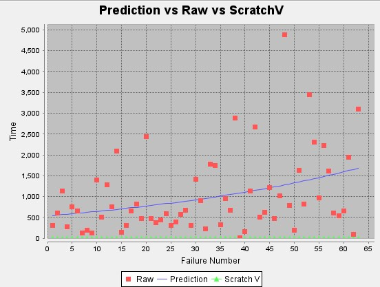
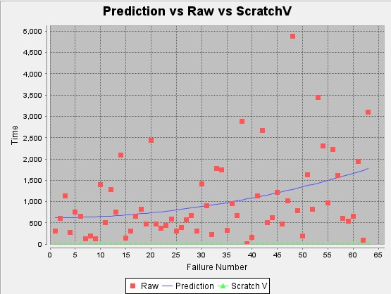
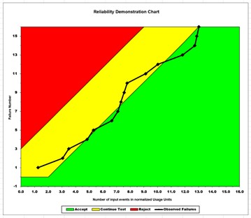
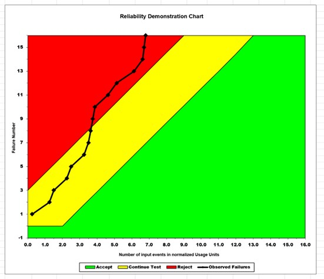
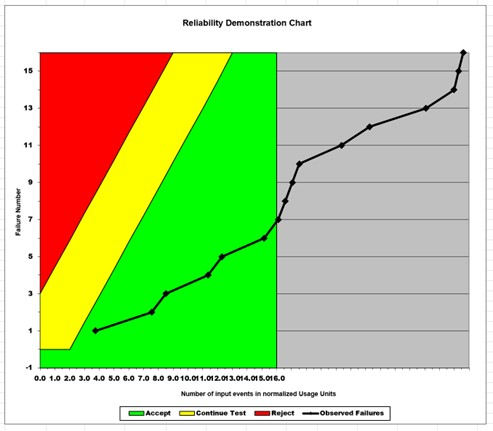

**SENG 438- Software Testing, Reliability, and Quality**

**Lab. Report \#5 – Software Reliability Assessment**

| Group \#:       |3   |
|-----------------|---|
| Student Names:  |   |
|          Tsenguun       |   |
|            Saman     |   |
|              Aryan   |   |

# Introduction
In this lab, we assessed sample failure data using reliability growth testing, and reliability assessment using RDC (Reliability Demonstration Chart). 

# Assessment Using Reliability Growth Testing 
Geometric Model:  
  

Littlewood and Varral's Bayesian Reliability Model:  
  

# Assessment Using Reliability Demonstration Chart 
Plot for MTTFmin=2.2:  
  
Plot for 2(MTTFmin)=4.4:  
  
Plot for ½(MTTFmin) = 1.1:  
  

To find MTTFmin, I used a point on the first graph that was on the border of yellow and green, then substituted the values into the formula, Tn = failure time/MTTF, to find MTTF. I calculated the MTTFmin to be 2.2.  

The advantage of RDC is that you can observe the trend of reliability in the system with limited failure data. It is cost and time efficient. The disadvantage is that it cannot determine an exact value for the reliability of the SUT, only whether it’s acceptable or not.  

# Comparison of Results
The charts from part 1 are similar to each other. The charts from parts 1 and 2 defer in the data they show. The reliability growth analysis charts show that the number of failures increase over time, and the reliability demo charts show whether a system is in the reject, continue, or accept regions of the chart.  
# Discussion on Similarity and Differences of the Two Techniques
The two techniques are similar in that they both can use inter failure times to assess reliability. The difference is that reliability growth analysis is used to track bugs in pre-release and guide the software testing process, while reliability demonstration charts are used to decide whether the system is acceptable or not in terms of reliability.  
# How the team work/effort was divided and managed
One of the group members worked on the reliability growth section, another member worked on the reliability demonstration chart section. The third group member worked on analyzing the results and compiling the report.  

# Difficulties encountered, challenges overcome, and lessons learned
Our team encountered a lot of difficulties near the beginning of the lab. The tools provided would not work on the given files so we had to manually create new files ourselves and format the given data so that it would be accepted by the tools. The tools themselves would only produce 2 models as inputting any other options would cause the software to crash.  
# Comments/feedback on the lab itself
It would be nice to have working failure data files in the future. The failure analysis software also has many bugs that need to be worked out.  